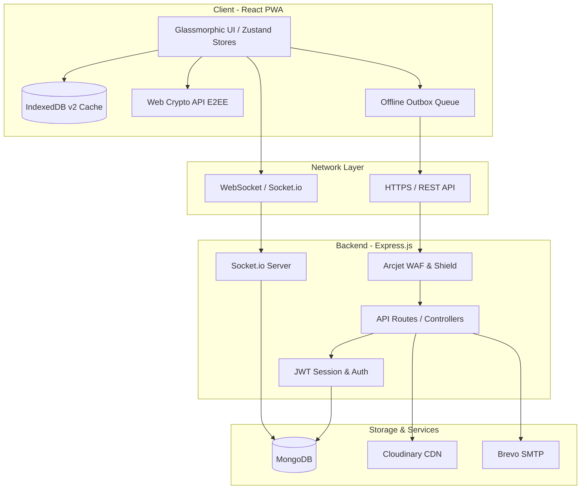

# Aether Chat — Enterprise-Grade Secure Real-Time Chat

Aether Chat is a state-of-the-art, secure real-time messaging application engineered with a React (Vite) PWA frontend and a Node.js (Express) backend. Built with a premium glassmorphism UI, a robust end-to-end encryption (E2EE) framework, offline synchronization, and active WAF shield intrusion protection.

---

## System Architecture



---

## Features & Capabilities

### Real-Time Chat & Group Messaging
- **Instant Messaging**: Seamless, bi-directional messaging powered by **Socket.io**.
- **Typing Indicators**: Live visual cues showing when a chat partner is typing.
- **Read Receipts**: Tracking and updates indicating when messages have been viewed.
- **Message Editing & Deletion**: Edit or delete sent messages with real-time propagation.
- **Replies & Mentions**: Multi-level quoted message replies and user tags.
- **Announcements & Pinned Posts**: Pin important updates to a dedicated board for channels.

### Cryptographic Safety & Recovery
- **End-to-End Encryption**: Zero-knowledge encryption simulation utilizing a Base64-scrambling layer prefixed with `enc:` for all text and media messages.
- **Secure Key Backup**: Employs pass-through mock KEK structures representing server-based private key backups and salt generation parameters.
- **Interactive Recovery**: Renders a credential recovery overlay on client-side IndexedDB clearance to mock private key restoration.

### Progressive Web App (PWA) & Offline Sync
- **IndexedDB Caching**: Local caching of contact lists, active chats, and the last 50 messages of active rooms.
- **Offline Outbox Queueing**: Queue messages composed while completely offline.
- **Sequential Reconnection Sync**: Flushes the outbox in series upon reconnection to preserve messaging timeline order.
- **Manual Retry Actions**: Outbox delivery failures display a red warning indicator for manual re-attempts.

### Hardened Security (WAF & Security Headers)
- **Web Application Firewall**: **Arcjet Shield** active in live mode to protect endpoints from SQLi, XSS, and directory traversal.
- **Sliding Window Rate Limiting**: Global rate limits applied to REST endpoints to prevent brute-force attacks.
- **Cookie-Based Sessions**: JWTs issued in `httpOnly`, `sameSite: strict`, and `secure` scoped cookies to prevent XSS-based token extraction.
- **Input Sanitization**: Intercepts malicious query operators to guard against MongoDB Injection.

---

## Technology Stack

| Domain | Technologies |
| :--- | :--- |
| **Frontend** | React, Vite, TailwindCSS, Zustand, Lucide Icons, Socket.io-client, Workbox PWA |
| **Backend** | Node.js, Express, MongoDB, Mongoose, Socket.io, JWT, Bcryptjs |
| **Security** | Arcjet (WAF & Bot Shield), Helmet (Security headers), Express Mongo Sanitize |
| **Services** | Cloudinary (CDN), Brevo (Transactional welcome emails), UploadThing (Document delivery) |

---

## Directory Structure

```text
ChatApp/
├── backend/            # Express REST API, Database Schemas, WebSockets
│   ├── src/
│   │   ├── controllers/# Business logic handlers
│   │   ├── middleware/ # Auth, WAF (Arcjet), socket validation
│   │   ├── models/     # Mongoose Schemas (User, Message, Group)
│   │   ├── routes/     # Route endpoints definitions
│   │   └── server.js   # Server initialization & Socket connections
│   └── package.json
├── frontend/           # React PWA, Tailwind Styles, Zustand Stores
│   ├── src/
│   │   ├── components/ # Reusable UI components & Modals
│   │   ├── pages/      # View pages (Chat, Settings, Login, Signup)
│   │   ├── store/      # Zustand state engines (Auth, Chat, Call)
│   │   ├── lib/        # Helpers (Crypto, Time, Sound, Axios)
│   │   ├── sw.js       # Background PWA service worker code
│   │   └── main.jsx    # Application entry point
│   ├── index.html
│   └── package.json
├── package.json        # Root scripts for building/running
└── README.md
```

---

## Project Setup & Installation

### Prerequisites
- Node.js (v18 or higher recommended)
- MongoDB Database (Atlas or local instance)
- Accounts with Cloudinary, Brevo, and Arcjet

### Quick Start Installation
1. Clone the repository and install all dependencies for both directories:
   ```bash
   npm run build
   ```
   *This command runs installation scripts for both the `backend` and `frontend` folders, compiles the assets, and prepares the production environment.*

---

## Configuration & Environment Variables

### 1. Backend Environment Configuration
Create a `backend/.env` file:
```env
PORT=3000
MONGO_URL=your_mongodb_connection_string
NODE_ENV=development
JWT_SECRET=your_jwt_secret_key

# Brevo Email Service Configuration
BREVO_API_KEY=your_brevo_api_key
EMAIL_FROM=onboarding@resend.dev
EMAIL_FROM_NAME=AetherChat
VERIFIED_EMAIL=your_email@example.com

# Frontend Application URL (for CORS and welcome links)
CLIENT_URL=http://localhost:5173

# Cloudinary Media Upload Configuration
CLOUDINARY_CLOUD_NAME=your_cloudinary_cloud_name
CLOUDINARY_API_KEY=your_cloudinary_api_key
CLOUDINARY_API_SECRET=your_cloudinary_api_secret

# Arcjet Security Shield Configuration
ARCJET_KEY=your_arcjet_api_key
ARCJET_ENV=development

# UploadThing configuration for PDF / large file uploads
UPLOADTHING_TOKEN=your_uploadthing_token_here

# Web Push VAPID keys for Push Notifications
VAPID_PUBLIC_KEY=your_vapid_public_key_here
VAPID_PRIVATE_KEY=your_vapid_private_key_here
VAPID_SUBJECT=mailto:admin@yourdomain.com
```

### 2. Frontend Environment Configuration
Create a `frontend/.env.development` or `frontend/.env.production` file:
```env
VITE_API_URL=http://localhost:3000

# Optional TURN server settings for WebRTC call signaling
VITE_COTURN_URL=stun:stun.l.google.com:19302
VITE_COTURN_USERNAME=your_coturn_username
VITE_COTURN_CREDENTIAL=your_coturn_credential
```

---

## Running the Application

### Local Development Mode
To run both backend and frontend servers concurrently for local development:

1. **Start Backend Server**:
   ```bash
   cd backend
   npm run dev
   ```
2. **Start Frontend Server**:
   ```bash
   cd frontend
   npm run dev
   ```

### Production Deployment Mode
1. Compile and build the static frontend assets:
   ```bash
   npm run build
   ```
2. Start the backend production server (which serves the compiled React assets statically):
   ```bash
   npm start
   ```

---

## License & Security Reports
For security vulnerability reports, please reach out directly at the verified contact listed in the configuration panel. E2EE guarantees that message contents are completely secure from third-party storage.
