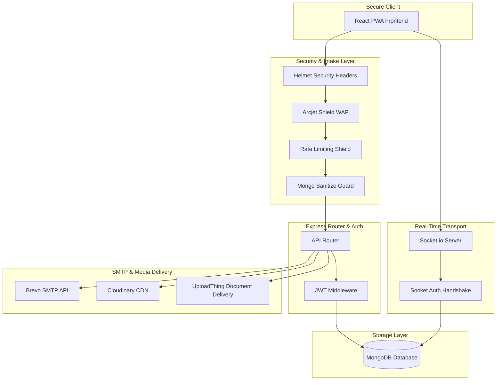

# Aether Chat Backend — Hardened Messaging Gateway

The backend of **Aether Chat** is a high-performance, secure messaging gateway built on **Node.js**, **Express**, **MongoDB (Mongoose)**, and **Socket.io**. 

Designed to defend against malicious web traffic and manage high-concurrency real-time WebSocket payloads, the gateway incorporates **Arcjet Web Application Firewalls (WAF)**, custom JWT cookie authorization, and transactional services.

---

## Architectural Topology



---

## Security Architecture & Hardening

The gateway implements a multi-tiered security defense structure:
*   **Arcjet WAF Shield**: Active detection checking incoming endpoints for SQL injection (SQLi), Cross-Site Scripting (XSS), and local/remote directory traversals.
*   **Sliding Window Rate Limiting**: Intelligent endpoint protection preventing brute-force authentication and message floods.
*   **Database Injection Guard**: `express-mongo-sanitize` middleware intercepts and strips characters containing `$` or `.` prefixes from client-submitted JSON objects.
*   **HTTP Header Security**: **Helmet** manages HTTP response headers, ensuring strict CSP rules, HSTS, frame protection, and referrer filters.
*   **Session Isolation**: Authentication tokens are transmitted exclusively inside `httpOnly`, `sameSite: strict`, and `secure` cookies to eliminate client-side script interception (XSS).

---

## Real-Time Socket Routing & Signal Engine

Real-time synchronization uses a robust **Socket.io** gateway implementation:
*   **Authentication Handshake**: Socket connections are validated on-connect using JWT cookie checks. Anonymous connections are rejected.
*   **Online Presence Tracker**: Maps user IDs to active Socket connections to provide live visual online/offline indicators.
*   **Messaging Signals**: Instantly broadcasts typing states, read receipts, text/media payloads, and messages updates.
*   **Rooms Partitioning**: Isolates group channel transmissions to dedicated room identifiers to optimize broadcast loads.

---

## Database Models & Schemas

### 1. User Schema (`User`)
*   Manages user profiles, credentials, and key recovery structures.
*   Stores the client's simulated backup parameters: `encryptedPrivateKey`, `privateKeyIv`, and `passwordSalt`.
*   Passwords stored as secure cryptographic hashes using **BcryptJS**.

### 2. Message Schema (`Message`)
*   Maintains Base64-scrambled message text payloads (simulated E2EE).
*   Contains the metadata properties required for client-side routing and simulated decryption: `isEncrypted`, `mediaIv`, and `groupId`.
*   Logs reading status, sending time, and author relationships.

### 3. Group Schema (`Group`)
*   Organizes group channels, user membership rolls, and administrative permissions.
*   Supports channel-wide **pinned announcements** and metadata updates.

---

## Setup & Configuration

### Environment Variables
Configure the gateway behavior by placing a `.env` file in the root of the `backend/` directory:

```env
PORT=3000
MONGO_URL=your_mongodb_connection_string
NODE_ENV=development
JWT_SECRET=your_jwt_secret_key

# Brevo Email Service Configuration
BREVO_API_KEY=your_brevo_api_key
EMAIL_FROM=onboarding@resend.dev
EMAIL_FROM_NAME=AetherChat
VERIFIED_EMAIL=your_email@example.com

# Frontend Application URL (for CORS and welcome links)
CLIENT_URL=http://localhost:5173

# Cloudinary Media Upload Configuration
CLOUDINARY_CLOUD_NAME=your_cloudinary_cloud_name
CLOUDINARY_API_KEY=your_cloudinary_api_key
CLOUDINARY_API_SECRET=your_cloudinary_api_secret

# Arcjet Security Shield Configuration
ARCJET_KEY=your_arcjet_api_key
ARCJET_ENV=development

# UploadThing configuration for PDF / large file uploads
UPLOADTHING_TOKEN=your_uploadthing_token_here

# Web Push VAPID keys for Push Notifications
VAPID_PUBLIC_KEY=your_vapid_public_key_here
VAPID_PRIVATE_KEY=your_vapid_private_key_here
VAPID_SUBJECT=mailto:admin@yourdomain.com
```

### CLI Scripts

Install backend dependencies:
```bash
npm install
```

Start the backend in development hot-reload mode (powered by Nodemon):
```bash
npm run dev
```

Start the backend in production mode:
```bash
npm start
```
