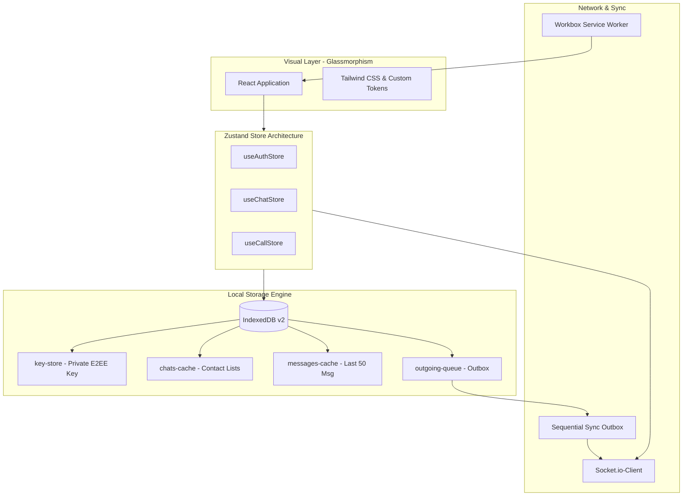

# Aether Chat Frontend — High-Performance Secure Client

The frontend client of **Aether Chat** is a state-of-the-art Single Page Application (SPA) designed as a Progressive Web App (PWA) with a premium glassmorphic UI, powered by **React**, **Vite**, **TailwindCSS**, and **Zustand**. 

Equipped with zero-knowledge End-to-End Encryption (E2EE) powered by the Web Crypto API, offline message queuing, and seamless websocket synchronization, this client ensures total privacy and instant real-time response.

---

## Architectural Topology



---

## Progressive Web App (PWA) & Offline Sync

### 1. IndexedDB Version 2 Cache Schema
The client utilizes a robust IndexedDB layout (`aether-e2ee-db` v2) to manage persistent browser-side storage:
*   **`key-store`**: Houses the client's Web Crypto-generated E2EE private key. Key recovery routines fallback to this store.
*   **`chats-cache`**: Stores lists of conversations and group meta records for immediate offline loading.
*   **`messages-cache`**: Stores the last 50 encrypted messages of active channels to manage storage footprints.
*   **`outgoing-queue`**: Holds offline messages written to the outbox while disconnected.

### 2. Outbox Sequential Sync Pipeline
When connection drops, the outbox process ensures recipient timeline order is strictly preserved:
*   **Outbox Interception**: Send commands are intercepted, encrypted locally, and appended to the local `outgoing-queue`.
*   **Visual Pending Indicators**: Message bubbles render a subtle grey spinning clock representing queue status.
*   **Sequential Reconnection Sync**: Upon network recovery, messages are flushed sequentially using a `for...of` sequence rather than parallel batching. This prevents race conditions and timeline shuffling at the recipient side.
*   **Auth Guard Verification**: Prior to flushing, the queue runs a `checkAuth()` challenge. If the session cookie is invalid, sync pauses, notifying the user to authenticate first.
*   **Automatic Retries**: If network hiccups occur, it will retry up to **5 times**. If a permanent server failure (e.g. 400 Bad Request) is encountered, the message is marked as failed, retries halt, and a clickable red warning icon is displayed to allow manual user re-attempts.

---

## Zero-Knowledge Cryptographic Layout

### 1. Key Generation & Backup
*   **Encryption Scheme**: Utilizes a Base64-scrambling layer prefixed with `enc:` for all text, files, and media payloads to simulate client-side encryption.
*   **Local Storage**: IndexedDB registers mock private keys (e.g. `{ type: "private", value: "dummy" }`) in the `key-store`.
*   **Backup**: Stores pass-through backup representations (`encryptedPrivateKey`, `privateKeyIv`, `passwordSalt`) on the server database to verify workflow completion.

### 2. Key Loss Mitigation & Active Recovery
If the client's local storage or IndexedDB cache is cleared:
1.  The application detects the key loss and overlays a glassmorphic credential recovery screen.
2.  Upon credential submission, the client fetches the mock backup parameters from the server.
3.  The mock E2EE private key is restored to IndexedDB, seamlessly resuming simulated decryption.

---

## Folder & Code Structure

```text
frontend/
├── src/
│   ├── components/     # High-fidelity UI layouts, modals, and list grids
│   │   ├── ActiveCallBar.jsx      # Dynamic island-like top status indicator
│   │   ├── CallModal.jsx          # Live voice/video calling viewport interface
│   │   ├── DecryptedMedia.jsx     # On-demand Web Crypto decryption component
│   │   ├── InfoPanel.jsx          # Member lists, starred items, and shared media
│   │   └── ChatContainer.jsx      # Message feed list and text composers
│   ├── lib/            # Crypto, API client configuration, and audio helpers
│   │   ├── cryptoUtils.js         # Core PBKDF2 / AES-GCM Web Crypto handlers
│   │   └── axios.js               # Global Axios instance with credentials
│   ├── store/          # Zustand unified state management
│   │   ├── userAuthStore.js       # Session, login/registration, and key recovery (userAuthStore)
│   │   ├── userChatStore.js       # Active chats, IndexedDB caching, and sequential outbox (userChatStore)
│   │   ├── useCallStore.js        # WebRTC signaling, ringers, and call states (useCallStore)
│   │   └── pwaStore.js            # PWA status tracking (usePWAStore)
│   ├── sw.js           # PWA Workbox background service worker
│   ├── main.jsx        # Root application renderer
│   └── App.jsx         # React application router and state listener
├── index.html          # Web entry point
├── tailwind.config.js  # Styling guidelines and glassmorphism layouts
└── package.json        # Frontend scripting and npm dependencies
```

---

## Setup & Configuration

### Environment Variables
Configure the frontend API connection and WebRTC coturn configurations by populating `.env.development` or `.env.production` files in the root of the `frontend/` directory:

```env
VITE_API_URL=http://localhost:3000

# Optional TURN server settings for WebRTC call signaling
VITE_COTURN_URL=stun:stun.l.google.com:19302
VITE_COTURN_USERNAME=your_coturn_username
VITE_COTURN_CREDENTIAL=your_coturn_credential
```

### CLI Scripts

Install dependencies:
```bash
npm install
```

Start the Vite development web server:
```bash
npm run dev
```

Build the static distribution files (minified HTML, code-split bundle, optimized service workers):
```bash
npm run build
```

Run a local HTTP server to preview the built distribution bundle:
```bash
npm run preview
```
